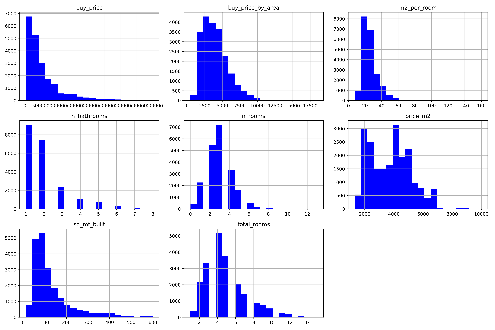
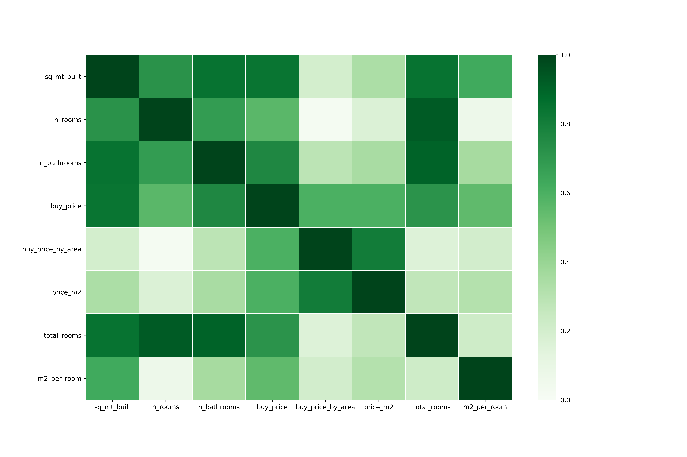
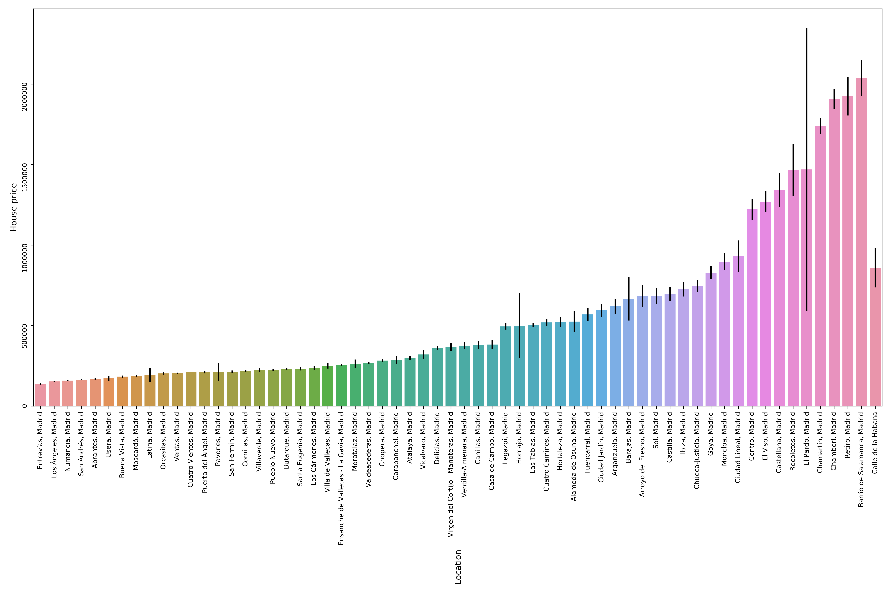
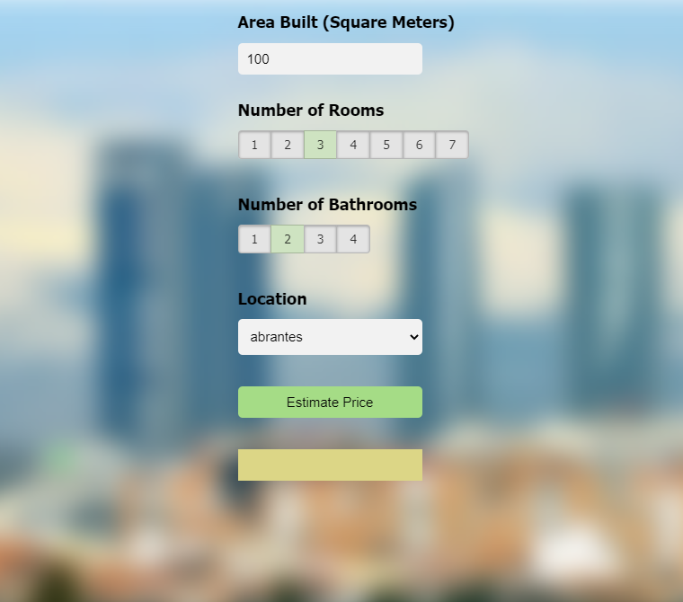

# Data Science Price Estimator from Houses in Madrid: Project Overview

* Created a tool that estimates prices from Madrid houses which can aid flat owners as well as people looking for a house to get an idea of the Real State Market in Madrid.

* Performed data cleaning steps and removed outliers.

* Exploratory Data Analyses shed light into the most important parameters driving house prices in Spain.These parameters were chosen in the model building process.

* Optimized Linear, Decission Tree, and Random Forest Regressors using GridsearchCV to reach the best model.

* Built a client facing API using flask.

# Code and Resources Used

**Python Version**: 3.7

**Packages**: pandas, numpy, sklearn, scipy, matplotlib, seaborn, flask, json, pickle

**Data-Set**: https://www.kaggle.com/mirbektoktogaraev/madrid-real-estate-market

**YouTube Tutorial**: https://www.youtube.com/playlist?list=PLeo1K3hjS3uu7clOTtwsp94PcHbzqpAdg

# 1. Data Cleaning

 I made the following changes:
 
* Formatted some columns

* Removed outliers

* Replaced Nans

# 2. Exploratory Data Analyses (EDA)

Looked at the distributions of the data, value counts and correlation among the various categorical variables. Below are a few highlight figures.

# 3. Model Building
Categorical variables  were transformed into dummy variables. Data Wwas splitted into train and tests sets with a test size of 20%.

I tried three different models and evaluated them using Mean Absolute Error. I chose MAE because it is relatively easy to interpret and outliers aren’t particularly bad in for this type of model.

I tried three different models:

Multiple Linear Regression – Baseline for the model
Lasso Regression – Because of the sparse data from the many categorical variables, I thought a normalized regression like lasso would be effective.
Random Forest – Again, with the sparsity associated with the data, I thought that this would be a good fit.

**Model Performance**: 
* Random Forest: Best_Score = 0.89
* Decission Tree Regression: Best_Score = 0.88
* Linear Regression: Best_Score = 0.86

  

# 4. Productionization

In this step, I built a flask API endpoint that was hosted on a local webserver. The API endpoint takes in a request with the list of house parameters and returns the estimated price. A website that makes use of the model prediction was also created.

